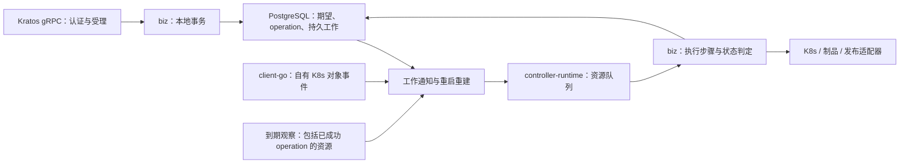

# SPEC：独立推理服务

状态：草案；日期：2026-09-10。需求来源为本任务中用户给出的十二条重构原则及后续修订；无前端范围。来源快照见[记录](../execution/records/2026-09-10-design-baseline.md)，取舍见 [ADR](../adr/0001-controller-and-authority.md)。

## 1. 已确认的边界

- 独立仓库、构建、版本和进程，使用固定版本 `ani-kratos-layout` 生成；生成后自行维护，不运行时依赖模板。
- 遵循 layout 的实际目录和 Kratos gRPC 装配。新接口独立版本化，不复制旧 ANI Proto、不经 Core PlatformWorkload 执行、不导入 ANI 业务 runtime。
- 用 client-go + controller-runtime 驱动 Kubernetes 执行和持续观察，不搬运旧自定义 Observer/Reconciler。框架接口本身仍叫 `Reconcile`，这不等于复用旧实现。
- GPU 通过 Kubernetes 扩展资源名（例如 `nvidia.com/gpu`）进入 `resources.requests/limits`；不传则正常启动，不设置专门 CPU 模式、不强制添加 `--device=cpu`。
- 新业务存储使用 PostgreSQL + sqlc，显式租户隔离，不使用 RLS、不写其他领域表。
- 不使用 `ani-core-platform` 技能及其旧 ANI 分层/契约门禁。本服务的工程依据是本规格、独立领域准则及固定模板运行合同。
- 本设计不授权前端修改、远程仓库创建、旧环境接管或集群部署。

## 2. 资源所有权

| 对象 | 权威与允许动作 | 不允许的动作 |
|---|---|---|
| 推理服务、配置、operation、幂等、业务事件 | Inference 在自身本地事务中受理、查询、执行、恢复、删除 | Gateway、任务中心或 Core 写入 Inference 状态 |
| 推理专属 Deployment、Pod template、Service | Inference 创建并维护自己资源集合的字段；记录 K8s UID | 接管普通 Compute 实例、仅凭名称/标签收养已有对象 |
| 推理专属 LWS | 后续明确支持后由 Inference 管生命周期 | 把旧 LWS 能力当不存在，或未经验证宣称已支持 |
| 发布意图及专属路由/策略对象 | Inference 管自己 publication 的建立、撤销和生效判断；具体 CR/字段在接线前列白名单 | 修改共享 Gateway/listener、覆盖数据面全局配置或他人 SecurityPolicy |
| 推理访问策略 | Inference 管资源级业务规则；数据面执行，身份权限由 IAM 判断 | 复制 IAM 身份/权限表，或把限流执行移入部署状态机 |
| 模型、版本、制品与源 PVC | Model/Storage 保持权威；Inference 消费不可变引用和受控访问凭据 | 复制模型目录、删除源 PVC/原始制品 |
| 推理专属制品缓存/暂存空间 | 只在明确本服务所有的临时目录或受控卷范围创建、清理 | 全局共享 RWO 卷被任意多节点重复挂载；将临时缓存变成模型目录权威 |
| VPC/Subnet、卷关联、集群/卡库存 | 相应 Network/Storage/Cluster/Inventory 领域保持权威 | 复制库存/网络表，发现卡后擅自建立配额账本 |
| 租户、身份、治理账本 | Core 租户/治理与 IAM 按各自边界提供协议 | 管理员身份默认绕过配额；借隔离切片修改旧共享事务 |

共享对象的字段、动作和删除权必须逐项记录。不同 label、namespace、field manager 或数据库租约不证明新旧写入者互斥。已有关联资源只引用；删除保护必须有可查询、幂等的跨域协议。

## 3. 工程结构与进程装配（草案）

以下是拟生成后的增量结构，不是目前已有的新服务代码。模板 `cmd/server` 会由官方生成链改名为 `cmd/ani-inference-service`；模板没有业务 `api/`、数据库或 Controller。

```text
ani-inference-service/
├── cmd/ani-inference-service/   # 模板入口；显式组合依赖，无第二个 composition root
├── api/inference/v1/           # 新增：独立 Proto 与生成代码
├── configs/                   # 模板配置入口；扩展 PG/K8s/依赖校验
├── internal/
│   ├── server/                # Kratos gRPC/admin、Manager 生命周期及观测接线
│   ├── service/               # Proto/身份上下文 ↔ biz；不直接写库/创建 Pod
│   ├── biz/                   # 领域、用例、事务及外部能力 ports
│   └── data/
│       ├── postgres/          # 集中 SQL、事务适配及 sqlc 生成代码
│       ├── kubernetes/        # Controller、watch 映射、client-go 与对象渲染
│       ├── model/             # 固定版本制品引用适配
│       └── publication/       # 数据面发布/撤销及生效检查适配
├── migrations/                # 新增：唯一 DDL 来源
├── sqlc.yaml                  # 新增：消费同一迁移目录
├── CONTEXT.md
└── docs/                      # 本设计包及生成器 provenance/runtime 文档
```

按切片需要增建 adapter，不预先建设通用插件平台或另一套 `domain/application` 层。`biz` 不导入 Kratos、Proto、K8s、PG 驱动；Controller 位于基础设施 adapter，通过 biz 用例处理事实，不把 Kubernetes 类型泄漏给领域。

仅保留一个 Kratos App：在模板已有 gRPC server 注册生成的服务，admin HTTP 继续承载健康和指标；不另建裸 `grpc.Server`。Manager 用 `internal/server` 生命周期适配加入同一 App，启动错误要使进程失败，退出时取消 watch/探测并等待有界停止。Manager 的健康端口和指标注册不得与模板重复绑定/冲突。

模板默认 gRPC `127.0.0.1:19090`、admin `127.0.0.1:19091`；部署配置才决定监听外网。配置、日志脱敏、链路、中间件和优雅停机沿用模板。gRPC health 与 `/readyz` 必须补充本服务的必要依赖和执行能力判断，不能沿用“AfterStart 即 ready”。单个模型失败不令整个进程 liveness 失败。

## 4. 独立 gRPC 控制契约（草案，未冻结 Proto）

拟用独立 `inference.v1` 包。名称中的 v1 是新服务自己的版本，不继承 ANI v1 兼容基线。初始方法：

| 方法 | 输入要点 | 行为与输出 |
|---|---|---|
| CreateInferenceService | request_id、name、model_artifact、engine、resources、replicas、served_model_name | 本地事务受理；返回 resource + operation，不等待模型启动 |
| GetInferenceService / ListInferenceServices | 已授权租户范围、资源 ID 或分页参数 | 纯读已持久化的资源状态与观察时效 |
| UpdateInferenceService | resource_id、request_id、expected_generation、field_mask、变更配置 | CAS 新 generation + 持久 operation；首期允许字段要明确白名单 |
| Start / Stop / RestartInferenceService | resource_id、request_id、expected_generation | 同一资源互斥的持久命令；Restart 不伪装成新建资源 |
| DeleteInferenceService | resource_id、request_id、expected_generation | 受理删除；异步撤发布和清理，保留可查结果及墓碑 |
| GetOperation / ListOperations | tenant scope、operation_id 或资源/分页过滤 | 纯读；不推进生命周期 |

日志流、访问策略管理、取消操作等独立扩展不得因未在此表冻结就被默认为已有接口；其能力排期见第 10 节和计划。

### 4.1 关键字段

- `resource_id`、模型目录 ID、模型版本 ID 分离，不再用一个 `model` 字段时而传名称、时而传版本 UUID。
- `model_artifact` 包含提供方、不可变版本引用、摘要和装载约定。有效性/租户可访问性由可信 Model 契约验证；不接受客户端任意内网 URL 作为制品下载位置。
- `engine` 包含固定镜像引用、类型及可选 command/args。保留自定义启动命令；传入时以 argv 执行，不经 shell 拼接、不被默认参数静默覆盖。装载目录、端口、模型别名和健康协议需与引擎契约一致，不一致返回明确原因。
- `resources.requests/limits` 直接遵循 Kubernetes `ResourceRequirements`。GPU 使用 `nvidia.com/gpu` 等扩展资源键；不可解析的资源量或资源名拒绝，绝不静默降级。不传 GPU 则不注入 GPU 资源、selector 或 GPU 专用队列；普通网络/存储调度约束仍保留。
- 普通 CPU/内存资源字段拟保留为容器资源配置，不能把 CPU 资源声明等同于 CPU 引擎模式。字段默认值、上下限在冻结 API 时确定；这不是对“cpu 去掉”扩大解释后的既定结论。
- 不传卡时，能否启动仍取决于镜像/引擎/模型兼容性。不自动附加旧实现的 CPU 专用环境变量或参数组合；模型通用参数来自显式引擎配置。正常启动不是保证 GPU-only 镜像可在 CPU 上运行，不能据此编造成功证据。
- `name` 是租户内推理资源展示/管理名称；`served_model_name` 是调用时的模型路由别名。建议后者在同租户有效发布集合唯一，冲突返回具体字段；不自动拼 UUID，不把别名冲突报成服务 name 冲突。将来同名多副本/多后端需要显式路由组，而不是偶然覆盖。
- `replicas` 初始切片限定为 1；其他值明确拒绝或在已验收能力中支持，不静默忽略。多节点/LWS 同理。

### 4.2 身份、幂等与错误

每个同步跳点验证直接 Caller Workload 及适用委托；资源租户必须来自或匹配经验证的授权上下文。Proto 如含 target_tenant，也只是待校验目标，不是身份凭证。普通 metadata/header、NetworkPolicy、传入 `tenant_id` 都不能代替认证。IAM Workload 固定版本未接入前，只能运行明确隔离的验证入口，不能宣称公共接入完成。

`request_id` 拟用作幂等命令身份，作用域为租户 + RPC 方法 + key；日志使用独立 correlation ID。规范化请求 hash 在服务端生成，同 key 同 payload 返回原 operation，不再次执行；不同 payload 返回 `ALREADY_EXISTS` 携带 `IDEMPOTENCY_CONFLICT`。资源业务重复返回不同 reason 和字段说明。删除、重试和故障恢复不能提前清理幂等关联；保留期须在 API 冻结时确定。

拟定错误：格式错误 `INVALID_ARGUMENT`；缺失身份 `UNAUTHENTICATED`；无权限 `PERMISSION_DENIED`；同租户不可见资源 `NOT_FOUND`；版本竞争 `ABORTED`；未满足状态/不支持配置 `FAILED_PRECONDITION`；依赖暂不可达 `UNAVAILABLE`。错误 details 包含安全的 reason、field、operation/correlation ID，不泄露其他租户名称、凭据或下载签名。鉴权错误不转成资源不存在；资源越租户查询可按不可见规则返回 NOT_FOUND。

列表用有界 keyset 分页，默认 `(created_at DESC, resource_id DESC)`；游标绑定租户、过滤和排序并做完整性校验。列表与详情复用同一只读投影，`invocation_url` 的可用/空值语义一致；未发布、已撤销或无法确认可调用时不能伪造地址成功。

## 5. 数据和本地事务（草案）

| 表 | 关键可查询字段/用途 |
|---|---|
| inference_services | tenant_id、id、name、desired_state、desired_generation、applied_generation、deleted_at |
| inference_specs | tenant_id、service_id、generation、artifact/version/digest、image、served_model_name、资源/引擎配置 |
| operations | tenant_id、id、service_id、kind、target_generation、phase、step、error_reason、retry_at、完成时间 |
| idempotency_requests | tenant_id、method、key、payload_hash、operation_id；唯一键限定租户 |
| publications | tenant_id、service_id、desired/observed_generation、phase、invocation_url、owned_object_ref |
| runtime_bindings | tenant_id、service_id、cluster_ref、namespace、kind/name、UID；记录本服务的真实对象归属 |
| observations | tenant_id、service_id、observed_generation、runtime_ready、invocation_health、observed_at、有效期/失败原因 |
| resource_work | tenant_id、service_id、dirty_version、ack_version、next_observe_at、重试/领取状态 |
| domain_events | tenant_id、event_id、schema_version、source_resource、operation_id、payload、投递状态 |

这是一份逻辑模型，不是已执行 DDL。所有租户关系使用包含 tenant_id 的唯一键和复合 FK；operations、历史/事件、幂等、关联同样受约束。source resource 的类型化业务字段不再重复藏入 JSONB；扩展参数可用受约束 JSONB，不建立多份核心字段真相。平台配置单独建模，不伪造“平台租户”。

资源变更、配置版本、operation、幂等、必要审计/事件、dirty 标记同一事务提交，提交后才返回受理。K8s、Model、发布系统调用不在 PG 事务中；失败进入可恢复步骤而不是回滚伪造跨系统原子性。已提交但响应丢失，用同 key 查回结果。

全部查询/更新经集中 SQL + sqlc，biz 不拼 SQL。运行凭据没有迁移 DDL 权限；跨租户工作扫描用独立内部 port/入口，返回显式 tenant scope，进入普通用例后仍校验租户。关闭 RLS 不表示可接受遗漏 tenant predicate；真实 PG 负向测试必须覆盖读取、更新、join、FK、幂等和平台入口越权。

新迁移目录是唯一 DDL，sqlc 与测试数据库重放同一来源；不修改旧共享表的 RLS 或复制 Model/IAM/Quota 表。

## 6. Controller 与持续恢复（草案）



InferenceService CRD 是 PostgreSQL desired state 的可重建投影，不是第二个业务权威。`source.Channel`/Watch 只是通知渠道，不能代替持久事件；Deployment/Service/Pod/LWS 仍是运行事实。API、启动恢复扫描、到期观察扫描都只标记/投递 ResourceWork，不各自实现一套执行循环。直接修改 CR 不得绕过 gRPC、配额、幂等和审计流程。

1. Controller 请求键稳定对应资源；事件映射必须通过已记录 UID/绑定核对资源租户和归属，不能只信 Pod label。
2. 获取工作后重新读 PG 的当前 generation 和状态，不按排队时的旧 payload 盲写。每一步持久化结果及下一步；创建用确定名称，未知请求结果先查询核对，不新建第二份。
3. 只有完成目标工作版本才更新 `ack_version`；执行期间新增 dirty_version 不被本次 ack 清掉。Channel 丢事件、队列合并、进程崩溃都可由 PG 恢复。
4. 周期扫描 due work 和所有未删除服务的观察义务，包含 operation 已完成、无用户 GET 的服务。Controller `RequeueAfter` 是加速机制，`next_observe_at` 才是重启后的恢复依据。
5. watched 对象变化可即时唤醒；模型加载由模型 ready 事实和 Kubernetes readiness 共同观察。API timeout/cache 未同步标记 unknown/stale，不能当真实 NotFound 后擅自重建或删除。
6. 操作完成后继续观察当前 runtime、模型和发布状态；数据面调用巡检属于可选运维能力，不作为 Inference operation 的完成门禁。

首期只承诺单活 runtime 执行进程，有界并发处理不同资源，同资源串行。PG CAS/领取版本防止旧业务结果覆盖；K8s 修改/删除使用 UID、resourceVersion 等适用前置条件。leader election 只做协调，不是 fencing。初始部署升级须先证明旧执行进程已退出；网络分区下不能凭租约过期、强删 Pod 就接管。自动多副本故障转移需额外证明旧执行者无法继续写 K8s/发布端，未验收前明确不支持。

退避、最大并发、观察新鲜度、队列容量、探测预算作为有界配置校验；容量目标和数值在实施包固定，不能用本次源码阅读当容量验收。

## 7. 生命周期和发布

状态分开保存：desired 为 `running/stopped/deleted`；operation 为 `pending/running/succeeded/failed`；runtime 为 `unknown/pending/loading/ready/degraded/stopped`；publication 为 `withdrawn/publishing/published/withdrawing/unknown`。具体 Proto 枚举待 API 冻结，但这些概念不能合并成一个“Running”。

### 创建与启动

受理 → 校验可信模型版本/依赖引用 → 物化制品 → 应用 runtime → 指定模型与协议就绪 → 发起发布 → 确认发布生效 → operation 成功。

持久步骤为 `observe_runtime → publish → complete`：
`observe_runtime` 校验目标 runtime 和模型事实；`publish` 确认目标 generation
的发布后即可完成 operation。发布后的数据面调用检查如有需要，另行由网关或运维
系统负责，不阻塞 Inference 业务状态机。

Pod Ready 不等于目标模型已加载；模型 ready 事实和发布确认仍需针对目标 generation。create/start 成功后按归属清理本次产生的资源；不动源制品/共享卷，残留写入恢复义务。

### 停止、重启、删除

受理 → 持久化撤发布意图 → 发布系统确认不再向本后端导入新请求 → 按数据面合同排空已有连接 → 才执行停止/重启/删除 runtime → 确認执行结果与资源释放 → operation 完成。运行中 update/restart 在确认 runtime 消失后先释放上一代配额，再为新 generation 预留配额。

重启随后走应用/加载/重新发布，不让旧路由绕过门槛。删除直到确认自有 runtime 消失且适用外部关联已释放才完成，保留墓碑和幂等结果。停止后配额保留/释放依治理协议定义，不自己结算。撤发布超时或无法证明生效时保持 `withdrawing/unknown` 并记录重试，不以“清理超时”为由先杀 runtime；公共调用地址同时标为不可用。已建立流的 drain 截止、强制终止规则要在数据面接线前固定，默认不提供隐式 force 绕过。

如果运行退化，更新资源健康；确认不安全的发布要撤销。观察暂不可达不误判删除，发布有效期/失效关闭策略须由数据面合同可验证地执行，不能凭控制面本地置空 URL 冒称流量已切断。

## 8. 对外依赖及产品接线

| 依赖 | 需要固定的能力 | 未就绪时的边界 |
|---|---|---|
| IAM | Caller Workload 验证、委托/租户范围、资源级权限、API key 调用授权 | 隔离 fixture 不等于公开 gRPC/API key 鉴权已接好 |
| Model | 租户可见不可变版本、摘要、可刷新制品凭据、删除/引用保护 | 不复制旧 Model Proto 或直接查 Model 库冒充独立接入 |
| Cluster/Inventory | 集群选择、适用卡资源描述和库存事实 | 库存不是预留承诺，不做临时卡账本 |
| Storage/Network | 引用、附着、释放、结果查询及补偿身份 | 必要协议未就绪不接管旧关联资源 |
| Core 治理 | 预留/提交/释放命令幂等、结果查询、失败补偿及责任 | 保留旧资源共同事务权威；隔离测试不等于线上可绕过 |
| 数据面/Envoy | 发布/撤发布 generation 确认、路由别名、授权、限流执行、排空与健康探测 | 无真实适配验收不能声称“启动后用户可用” |
| Gateway/公共能力 | 独立 SDK 接线、只读聚合；事件版本、去重和适用顺序规则 | 不将资源状态机和后台执行又搬回 Gateway |

普通用户调用只需数据面凭证、model 和请求内容；不要求提供 `x-ani-tenant-id`、服务 UUID、`x-ai-eg-model` 等内部路由 header。可信租户来自凭证授权，路由别名按该租户解析。新 gRPC 管理接口不代替 Chat/Embedding 数据面协议。

脱离旧契约不等于消费者自动兼容。接线阶段必须列出旧 HTTP 路径/SDK 到新 RPC 的显式映射，模型引用、名称冲突、分页/排序、状态/错误、幂等和 invocation_url 的变化；提供固定版本客户端和迁移安排。默认不改旧 ANI v1，更不要求新服务遵守其旧内部执行边界。

已识别的具体差异：新 `request_id` 替代旧幂等字段的提案、新模型版本/制品引用取代含糊的 `model`、独立 gRPC 错误 details，以及 create/start 的 operation 成功拟等待发布与调用确认（旧 worker 先完成操作再触发发布）。这些须在新 API 冻结时确认，并让消费者调整字段映射、重试和等待；不能以“独立仓库”为由隐瞒语义变化。

## 9. 安全、运行与可观测

最小权限 RBAC 只允许自有资源动作，租户 namespace/集群凭据由明确授权配置提供，不自动创建/删除整个租户 namespace。制品访问采用可信短期授权，摘要校验、大小/超时限制、安全解包、失败可重试；不能把签名 URL 或凭据写日志/事件。模型物化默认可用 HTTP 与否必须显式配置，历史临时放行不继承为新服务默认值。

用户自定义 command 不获得宿主机、特权容器、任意 Secret 或跨租户 PVC 权限。模型源路径/对象和运行下载 URL 分离，避免路径穿越与 SSRF。用户日志按租户/资源授权读取，关联 request/resource/operation；不是把所有容器或下载器原始日志广播给其他租户。

必要指标：受理/操作时延、积压与最老工作年龄、重试、观测延迟/stale 数、模型加载时延、发布/撤销时延、依赖错误、恢复失败。标签禁止 resource_id/tenant_id/request_id 等高基数字段；详细关联放结构化脱敏日志/trace。`/metrics` 可读与真实采集分别验证。核心依赖故障影响 readiness 与领域条件，不用 liveness 重启掩盖持久恢复问题。

## 10. 验收与能力保留

| 编号 | 必须验证的行为 | 最低证据层 |
|---|---|---|
| V-01 | 固定模板生成、独立 module，无 ANI/template runtime import、复制 Proto、本机 replace；Kratos 装配可启停 | 源码 + 正式进程 |
| V-02 | tenant 负向、复合 FK、幂等竞争、事务故障/响应丢失、迁移升级 | 真实 PostgreSQL |
| V-03 | 不传卡无 GPU/forced CPU 参数；传卡正确渲染且不降级；自定义 command 不被改写 | 渲染单测 + 真实 K8s 启动；有/无卡能力分别记录 |
| V-04 | 受理后无人查询、通知丢失、控制进程重启仍完成工作，确定资源不重复 | 正式进程 + 真实 PG/K8s |
| V-05 | operation 成功后删除 Pod、引擎失联、模型不健康仍被发现；状态有时效 | 真实 K8s/引擎及调用链 |
| V-06 | 撤发布失败不提前停止/重启/删除；已建连接按合同排空，无旧路由指向停止后端 | 真实发布数据面 + 带身份探测 |
| V-07 | GET/LIST 无写入/结算/推进；真实多页无静态数据重复遗漏、最新在前；地址语义一致 | 真实 PG + gRPC |
| V-08 | 服务名/别名分别冲突；只带 API key + model 调用 Chat/Embedding；越租户不可路由 | IAM + 数据面产品链 |
| V-09 | 制品下载/校验/解包/恢复、源 PVC 删除保护、RWO 约束、断流恢复 | 真实 Model/Storage/K8s |
| V-10 | UID/写入者冲突拒绝；失去执行资格不继续变更；不收养旧资源 | 故障注入 + K8s 请求证据 |
| V-11 | 限流执行、策略隔离/更新、日志授权；部署完成不等于策略生效 | 真实数据面 |
| V-12 | 停止/删除补偿、外部引用释放与幂等结果；重启不重复扣/释放配额 | 真实领域协议及故障注入 |

GPU 资源声明、LWS/多节点、制品物化、自定义命令、日志流、Embedding、访问/限流策略都是旧能力迁移清单，不能静默丢失。初始单模型/单副本验证不得被写成全能力迁移通过；超出已验收能力的请求要明确拒绝。每项证据分别记 `pass/fail/not_verified`，不得以 fake/envtest 覆盖真实调度、存储、引擎或调用验收。

## 11. 冻结前仍需落实

- 普通 CPU/内存字段的最终形状和限制；目前只确认无专门 CPU 模式，不把模糊点写成已批准删除字段。
- client-go/controller-runtime 及 K8s API 的兼容版本组：按验证集群和 Go 基线锁定，不随手选 latest。
- 新 Proto 的字段/枚举、超时与幂等保留期，以及游标/数据保留策略。
- IAM、Model、发布数据面、资源关联和治理的固定版本契约；不存在就明确阻止对应公开接线，不造一个临时领域权威。
- 首个真实引擎镜像/模型摘要、验证卡资源及可无卡运行的能力证据。此前 vLLM 镜像引用不自动成为新服务兼容证明。
- 发布对象精确白名单、生效/撤销/排空判据和观测失效策略；单活进程升级与 fencing 验证方法。

这些是实施/接线包的入口条件，不阻止本轮设计评审；也不能被文档生成掩盖为已验证事实。
